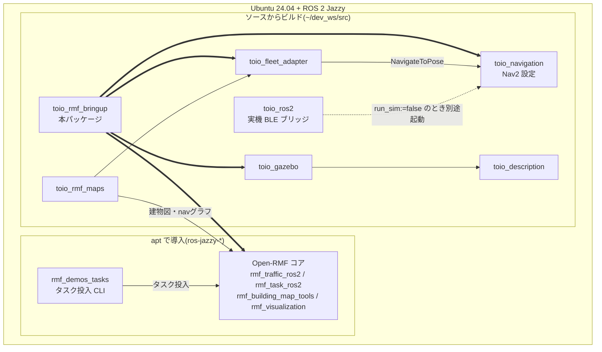

# toio_rmf_bringup

Open-RMFコア・toio用フリートアダプタ・Gazeboシミュレーション・Nav2を
1コマンドで一括起動するパッケージ。

**環境構築**(新規PC): [docs/SETUP.md](docs/SETUP.md) 参照。
`scripts/setup_environment.sh` でapt導入からビルドまで自動化できる。

## 対応環境と関連パッケージ

対応ディストリは **ROS 2 Jazzy(Ubuntu 24.04)のみ**。Open-RMFはJazzyでは
バイナリdebが揃っているためソースビルド不要で、toio側の各パッケージのみ
`~/dev_ws/src` にソースを置いてビルドする。



太い矢印が `toio_rmf.launch.py` から起動されるものを表す。

| パッケージ | 入手方法 | ブランチ | 役割 |
|---|---|---|---|
| Open-RMF一式 | apt (`ros-jazzy-rmf-dev` ほか) | — | RMFコア |
| `rmf_demos_tasks` | apt | — | タスク投入CLI |
| `toio_rmf_bringup` | ソース | `main` | 本パッケージ。一括起動 |
| `toio_fleet_adapter` | ソース | `main` | EasyFullControlアダプタ |
| `toio_rmf_maps` | ソース | `main` | 建物図・navグラフ・座標整合の検証 |
| `toio_navigation` | ソース | `jazzy` | Nav2設定・地図 |
| `toio_gazebo` | ソース | `main` | マルチロボットのGazeboワールド |
| `toio_description` | ソース | `main` | キューブのロボットモデル |
| `toio_ros2` | ソース | `jazzy` | 実機のBLEブリッジ(シミュレーション時は不要) |

ブランチはいずれも各リポジトリのデフォルトブランチで、`setup_environment.sh` が
そのままcloneする。

## 起動(シミュレーション)

```bash
source /opt/ros/jazzy/setup.bash
source ~/dev_ws/install/setup.bash
ros2 launch toio_rmf_bringup toio_rmf.launch.py mat:=a3 use_sim_time:=true
```

主な引数:

| 引数 | デフォルト | 説明 |
|---|---|---|
| `mat` | `a3` | 使用マット(`a3` / `a4`) |
| `use_sim_time` | `true` | シミュレーション時刻を使用 |
| `run_sim` | `true` | toio_gazeboマルチシミュレーションも起動 |
| `run_nav` | `true` | toio_navigation(Nav2)も起動 |
| `use_nav_rviz` | `false` | ロボット毎のNav2 RVizを起動 |
| `rmf_headless` | `false` | RMFスケジュールビジュアライザRVizを抑止 |
| `server_uri` | `''` | rmf-web api-serverのURI(任意) |

実機の場合は `run_sim:=false` とし、別端末で
`ros2 launch toio_ros2 toio_multi_bringup.launch.py` を起動する。

## タスク投入例

```bash
# patrol: patrol_A → patrol_D を3周
ros2 run rmf_demos_tasks dispatch_patrol -p patrol_A patrol_D -n 3 --use_sim_time
```

navグラフ頂点(toio_rmf_maps参照):

- A3: `charger_1` / `patrol_A` / `patrol_B` / `patrol_C` / `patrol_D` / `charger_2`(双方向格子)
- A4: `charger_1` / `patrol_A` / `charger_2` / `patrol_B`(**時計回りの一方通行ループ**)

**A4での2台同時運用の注意**: マットが狭く(0.30×0.20m)、charger頂点付近で
2台が同時に入替るタイミングでは角が接触し得る(シミュレーション実測)。
2台での確実な非接触運用にはA3を推奨。peer costmapのフットプリントは
`peer_footprint_size:=auto` でA3=0.10 / A4=0.06が自動設定される。

## 構成

- RMFコア: rmf_traffic_schedule / rmf_traffic_blockade /
  building_map_server / rmf_task_dispatcher / rmf_visualization
  (rmf_demosのcommon.launch.xml相当。door/lift supervisorは不要のため省略)
- toio_fleet_adapter: EasyFullControlアダプタ(名前空間付き
  NavigateToPoseアクションでNav2に接続)
- toio_gazebo + toio_navigation: 既存パッケージをそのままinclude
