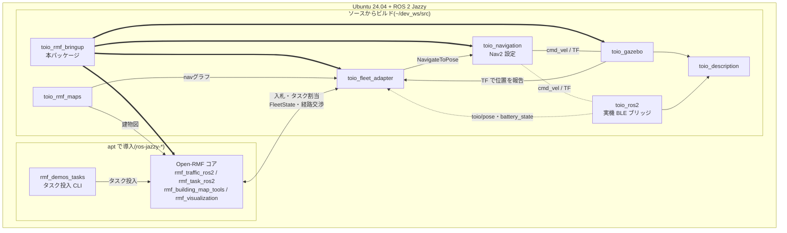

# toio_rmf_bringup

[](https://github.com/atinfinity/toio_rmf_bringup/actions/workflows/colcon-test.yml)

Open-RMFコア・toio用フリートアダプタ・Gazeboシミュレーション・Nav2を
1コマンドで一括起動するパッケージ。

**環境構築**(新規PC): [docs/SETUP.md](docs/SETUP.md) 参照。
`scripts/setup_environment.sh` でapt導入からビルドまで自動化できる。

**Open-RMFのフリート処理を段階的に学びたい方**(ROS 2中級者向け): toio_gazebo
シミュレーションで入札・交通調停・充電までを手を動かして学ぶチュートリアルを
[docs/tutorial/](docs/tutorial/README.md) に用意している。

## 対応環境と関連パッケージ

対応ディストリは **ROS 2 Jazzy(Ubuntu 24.04)のみ**。Open-RMFはJazzyでは
バイナリdebが揃っているためソースビルド不要で、toio側の各パッケージのみ
`~/dev_ws/src` にソースを置いてビルドする。



太い矢印は `toio_rmf.launch.py` が起動するもの、破線は実機運用時(既定の
`run_sim:=false`)だけ現れる接続を表す。

`toio_fleet_adapter` は走行指令をNav2の `NavigateToPose` に委譲する一方、
ロボットの位置は自分で受け取る。実機では `toio_ros2` の `toio/pose` と
`toio/battery_state` を購読し、シミュレーションではそれらが無いため
TF(`map` → ベースフレーム)にフォールバックする。`toio_description` は
シミュレーションと実機の両方から参照される。

| パッケージ | 入手方法 | ブランチ | 役割 |
|---|---|---|---|
| Open-RMF一式 | apt (`ros-jazzy-rmf-dev` ほか) | — | RMFコア |
| `rmf_demos_tasks` | apt | — | タスク投入CLI |
| `toio_rmf_bringup` | ソース | `main` | 本パッケージ。一括起動 |
| `toio_fleet_adapter` | ソース | `main` | EasyFullControlアダプタ |
| `toio_rmf_maps` | ソース | `main` | 建物図・navグラフ・座標整合の検証 |
| `toio_navigation` | ソース | `jazzy` | Nav2設定・地図 |
| `toio_gazebo` | ソース | `main` | マルチロボットのGazeboワールド |
| `toio_description` | ソース | `main` | キューブのロボットモデル |
| `toio_ros2` | ソース | `jazzy` | 実機のBLEブリッジ(シミュレーション時は不要) |

ブランチはいずれも各リポジトリのデフォルトブランチで、`setup_environment.sh` が
そのままcloneする。

## 起動

デフォルトは**実機運用**(`use_sim_time:=false` / `run_sim:=false`)。
シミュレーションで動かす場合は両方を明示的に `true` にする。

### 実機

起動は2段階。**実機ブリッジを先に起動すること** — nav2 の costmap がブリッジ由来の
TF を待つため、逆順で `initial_transform_timeout` を超えると nav2 が恒久的に
起動失敗する(詳細と復旧方法は [docs/SETUP.md](docs/SETUP.md) の「起動(2端末)」を参照)。

```bash
# 端末1: 実機ブリッジ(BLE接続。キューブの電源を入れてから)
source /opt/ros/jazzy/setup.bash
source ~/dev_ws/install/setup.bash
ros2 launch toio_ros2 toio_multi_bringup.launch.py

# 端末2: RMFコア + フリートアダプタ + Nav2 一式
source /opt/ros/jazzy/setup.bash
source ~/dev_ws/install/setup.bash
ros2 launch toio_rmf_bringup toio_rmf.launch.py mat:=a4
```

キューブの初期配置(チャージャー頂点への置き方)は
[docs/SETUP.md](docs/SETUP.md) の「キューブの初期配置」を参照。

### シミュレーション

```bash
source /opt/ros/jazzy/setup.bash
source ~/dev_ws/install/setup.bash
ros2 launch toio_rmf_bringup toio_rmf.launch.py mat:=a3 run_sim:=true use_sim_time:=true
```

### 主な引数

| 引数 | デフォルト | 説明 |
|---|---|---|
| `mat` | `a3` | 使用マット(`a3` / `a4`) |
| `use_sim_time` | `false` | シミュレーション時刻を使用(シミュレーション時は `true`) |
| `run_sim` | `false` | toio_gazeboマルチシミュレーションも起動(実機では実機ブリッジを別途起動する) |
| `run_nav` | `true` | toio_navigation(Nav2)も起動 |
| `use_nav_rviz` | `false` | ロボット毎のNav2 RVizを起動 |
| `rmf_headless` | `false` | RMFスケジュールビジュアライザRVizを抑止 |
| `server_uri` | `''` | rmf-web api-serverのURI(任意) |

## タスク投入例

```bash
# patrol: patrol_A → patrol_D を3周(シミュレーション時は --use_sim_time を付ける)
ros2 run rmf_demos_tasks dispatch_patrol -p patrol_A patrol_D -n 3
```

`dispatch_patrol` の引数:

| 引数 | デフォルト | 説明 |
|---|---|---|
| `-p` / `--places` | (必須) | 巡回先のwaypoint名。スペース区切りで複数指定し、並べた順に訪問する |
| `-n` / `--rounds` | `1` | `-p` の並びを何周するか |
| `-F` / `--fleet` | — | フリート名。本パッケージでは `toio` |
| `-R` / `--robot` | — | ロボット名(`toio1` / `toio2`)。`-F` と併用したときだけ有効で、入札を経ずそのロボットへ直接割り当てる(`robot_task_request`)。`-F` 単独ならそのフリート内で入札させる |
| `-st` / `--start_time` | `0` | 何秒後に開始するか |
| `--use_sim_time` | 無効 | シミュレーション時刻を使う。`use_sim_time:=true` で起動した場合は付ける |

`-pt` / `--priority` も受け付けるが、上流 `rmf_demos_tasks` 側が未実装
(`todo(YV): Fill priority after schema is added`)でリクエストに反映されない。

特定の1台だけを動かす例:

```bash
ros2 run rmf_demos_tasks dispatch_patrol -p patrol_A patrol_D -n 3 -F toio -R toio1
```

delivery タスクも投入できる(pickup / dropoff の荷役要求には launch が起動する
mockワークセル `toio_dispenser` / `toio_ingestor` が応答する)。

各タスクの中身(走行経路・投入の流れ・delivery / go_to_place / ChargeBattery /
キャンセル)は [docs/TASKS.md](docs/TASKS.md) に図で解説している。

ブラウザからタスクを投入・監視したい場合は、rmf-web(api-server + ダッシュボード)を
コンテナで起動できる(任意)。手順は [docs/DASHBOARD.md](docs/DASHBOARD.md) 参照。

navグラフ頂点(toio_rmf_maps参照):

- A3: `charger_1` / `patrol_A` / `patrol_B` / `patrol_C` / `patrol_D` / `charger_2`(双方向格子)
- A4: `patrol_A` / `patrol_B` / `approach_1` / `approach_2`(**時計回りの一方通行ループ**)+ `charger_1` / `charger_2`(approach から双方向の支線を伸ばした先)

**A4での2台同時運用の注意**: マットが狭く(0.30×0.20m)、2台が頂点付近で
同時に入れ替わるタイミングでは角が接触し得る(旧レイアウトでのシミュレーション実測)。
チャージャー通過時にドックの内蔵走行が駐機中の相手へ直進する衝突経路は
toio_rmf_maps#6 でチャージャーを支線の先へ移して解消済み。2台での確実な非接触運用にはA3を推奨。
peer costmapのフットプリントは `peer_footprint_size:=auto` で
A3=0.10 / A4=0.06が自動設定される。

## 構成

- RMFコア: rmf_traffic_schedule / rmf_traffic_blockade /
  building_map_server / rmf_task_dispatcher / rmf_visualization
  (rmf_demosのcommon.launch.xml相当。door/lift supervisorは不要のため省略)
- toio_fleet_adapter: EasyFullControlアダプタ(名前空間付き
  NavigateToPoseアクションでNav2に接続)
- mockワークセル: `toio_dispenser` / `toio_ingestor`
  (`scripts/mock_workcells.py`。deliveryの荷役要求に応答する)
- toio_gazebo + toio_navigation: 既存パッケージをそのままinclude
