# 構成とパッケージ関係

本パッケージが起動するノードと、依存する各パッケージの関係をまとめる。

## 対応環境と関連パッケージ

対応ディストリは **ROS 2 Jazzy(Ubuntu 24.04)のみ**。Open-RMFはJazzyでは
バイナリdebが揃っているためソースビルド不要。toio側の各パッケージのみ
`~/dev_ws/src` にソースを置いてビルドする。

太い青矢印は `toio_rmf.launch.py` が起動するものを、破線は実機運用時(既定の
`run_sim:=false`)だけ現れる接続を表す。

`toio_fleet_adapter` は走行指令をNav2の `NavigateToPose` に委譲する一方、
ロボットの位置は自分で受け取る。実機では `toio_ros2` の `toio/pose` と
`toio/battery_state` を購読し、シミュレーションではそれらが無いため
TF(`map` → ベースフレーム)にフォールバックする。`toio_description` は
シミュレーションと実機の両方から参照される。

| パッケージ | 入手方法 | ブランチ | 役割 |
|---|---|---|---|
| Open-RMF一式 | apt (`ros-jazzy-rmf-dev` ほか) | — | RMFコア |
| `rmf_demos_tasks` | apt | — | タスク投入CLI |
| `toio_rmf_bringup` | ソース | `main` | 本パッケージ。一括起動 |
| `toio_fleet_adapter` | ソース | `main` | EasyFullControlアダプタ |
| `toio_rmf_maps` | ソース | `main` | 建物図・navグラフ・座標整合の検証 |
| `toio_navigation` | ソース | `jazzy` | Nav2設定・地図 |
| `toio_gazebo` | ソース | `main` | マルチロボットのGazeboワールド |
| `toio_description` | ソース | `main` | キューブのロボットモデル |
| `toio_ros2` | ソース | `jazzy` | 実機のBLEブリッジ(シミュレーション時は不要) |

ブランチはいずれも各リポジトリのデフォルトブランチで、`setup_environment.sh` が
そのままcloneする。

## navグラフ頂点

頂点の定義は toio_rmf_maps を参照。

- A3: `charger_1` / `patrol_A` / `patrol_B` / `patrol_C` / `patrol_D` / `charger_2`(双方向格子)
- A4: `patrol_A` / `patrol_B` / `approach_1` / `approach_2`(**時計回りの一方通行ループ**)+ `charger_1` / `charger_2`(approach から双方向の支線を伸ばした先)

**A4での2台同時運用の注意**: マットが狭く(0.30×0.20m)、2台が頂点付近で
同時に入れ替わるタイミングでは角が接触し得る(旧レイアウトでのシミュレーション実測)。
チャージャー通過時、ドックの内蔵走行が駐機中の相手へ直進する衝突経路があったが、
toio_rmf_maps#6でチャージャーを支線の先へ移して解消済み。2台での確実な非接触運用にはA3を推奨。
peer costmapのフットプリントは `peer_footprint_size:=auto` で
A3=0.10 / A4=0.06が自動設定される。

## launch が起動するもの

- RMFコア: rmf_traffic_schedule / rmf_traffic_blockade /
  building_map_server / rmf_task_dispatcher / rmf_visualization
  (rmf_demosのcommon.launch.xml相当。door/lift supervisorは不要のため省略)
- toio_fleet_adapter: EasyFullControlアダプタ(名前空間付き
  NavigateToPoseアクションでNav2に接続)
- mockワークセル: `toio_dispenser` / `toio_ingestor`
  (`scripts/mock_workcells.py`。deliveryの荷役要求に応答する)
- toio_gazebo + toio_navigation: 既存パッケージをそのままinclude

## 関連ドキュメント

- [README](../README.md) — 概要とクイックスタート
- [docs/LAUNCH.md](LAUNCH.md) — 起動方法・launch 引数・タスク投入
- [docs/TASKS.md](TASKS.md) — サンプルタスクの図解
