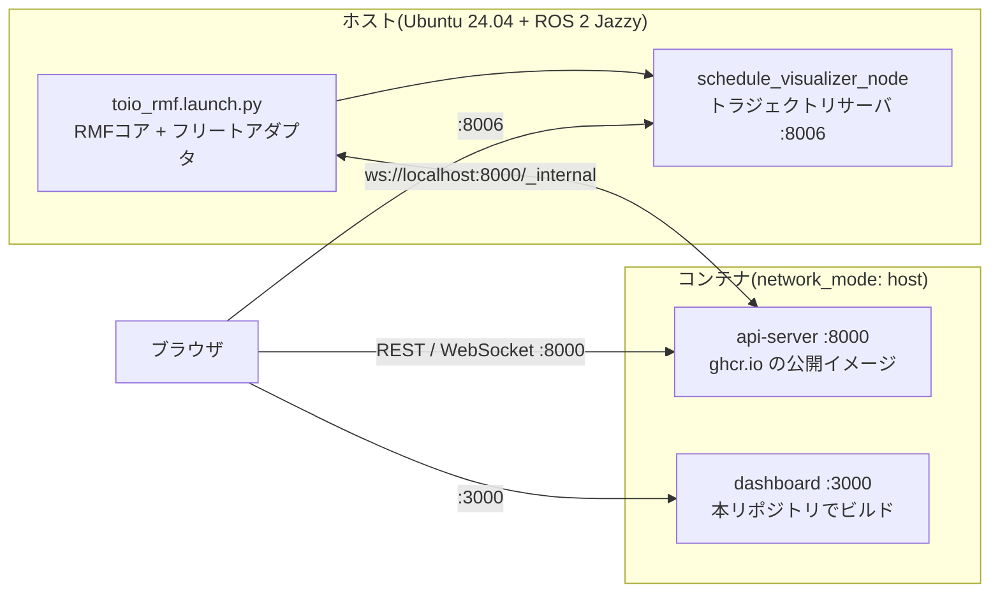

# rmf-web ダッシュボード(任意)

ブラウザからタスクを投入し、フリートを監視するための rmf-web を
コンテナで起動する手順。CLI(`rmf_demos_tasks`)と RViz だけでも運用できるので、
この構成は任意で、使わなくても本パッケージの動作には影響しない。

## 構成

ROS 2 スタックはホストでそのまま動かし、rmf-web だけをコンテナ化する。
`toio_rmf.launch.py` には手を入れず、`server_uri` を渡すだけで接続される。



トラジェクトリサーバ(8006)は `rmf_visualization` の `schedule_visualizer_node`
が既定で立てるため、`toio_rmf.launch.py` を起動していればすでに動いている
(`rmf_headless:=true` にしても抑止されるのは RViz だけ)。

## 前提

- Ubuntu 24.04、Docker Engine + Compose プラグイン
  (`sudo apt install docker.io docker-compose-v2` など)
- `docs/SETUP.md` の環境構築が済んでいること
- ダッシュボードのベースイメージ `minimal-rmf` は **linux/amd64 のみ**公開されている
- **この compose 構成は Docker Desktop for Mac / Windows では使えない。**
  コンテナが Linux VM の別ネットワーク名前空間で動くため DDS が届かず、
  タスク投入もマップ表示もできない。さらに `ROS_DOMAIN_ID` をホストと揃えると
  **ホスト側の ROS 2 が起動しなくなる**(下記トラブルシュート参照)。
  macOS では代わりに「[コンテナを使わない構成](#コンテナを使わない構成)」を使う

## 起動手順

### 1. ダッシュボードイメージをビルド(初回のみ)

```bash
cd ~/dev_ws/src/toio_rmf_bringup/docker
docker compose build dashboard
```

rmf-web の monorepo を取得して pnpm でビルドするため時間がかかる。
api-server 側は公開イメージをそのまま使うのでビルドは不要。

### 2. コンテナを起動

```bash
docker compose up -d
docker compose logs -f api-server   # 起動確認
```

### 3. ROS 2 スタックを `server_uri` 付きで起動

```bash
source /opt/ros/jazzy/setup.bash
source ~/dev_ws/install/setup.bash
ros2 launch toio_rmf_bringup toio_rmf.launch.py \
  mat:=a3 use_sim_time:=true \
  server_uri:=ws://localhost:8000/_internal
```

### 4. ブラウザで開く

<http://localhost:3000>

Map タブにマットと2台のキューブ、Tasks タブから patrol タスクの投入ができる。

## 設定

`docker compose` は同ディレクトリの `.env` または環境変数を読む。

| 変数 | 既定 | 説明 |
|---|---|---|
| `ROS_DOMAIN_ID` | `0` | **ホストと一致必須**。ずれるとフリートが見えない |
| `RMW_IMPLEMENTATION` | `rmw_fastrtps_cpp` | **ホストと一致必須** |
| `USE_SIM_TIME` | `true` | シミュレーションなら `true`、実機運用なら `false` |
| `RMF_API_SERVER_HOST` | `127.0.0.1` | 別マシンのブラウザから開くなら `0.0.0.0` |
| `RMF_API_SERVER_PUBLIC_URL` | `http://localhost:8000` | 上記を変えた場合は実IPに合わせる |
| `RMF_WEB_IMAGE_TAG` | `jazzy-nightly` | api-server イメージのタグ |
| `DASHBOARD_PORT` | `3000` | ダッシュボードの待受ポート |
| `DASHBOARD_ZOOM` | (`main.tsx` の既定 `11`) | マップの初期ズーム |
| `DASHBOARD_ROBOT_ZOOM` | (`main.tsx` の既定 `13`) | ロボット注目時のズーム |

実機で使う例:

```bash
USE_SIM_TIME=false docker compose up -d
```

ズームを変える場合はビルド時の値なので、変更後に再ビルドが必要:

```bash
DASHBOARD_ZOOM=12 docker compose build dashboard && docker compose up -d
```

## toio 向けにデモ設定から変えている点

`docker/dashboard/main.tsx` が rmf-web の `examples/demo/main.tsx` を置き換える。

| 項目 | upstream デモ | toio |
|---|---|---|
| `defaultZoom` | `6`(約 64 px/m) | `11`(約 2000 px/m)。A3マットは 0.42 × 0.30 m しかないため |
| `defaultRobotZoom` | `20` | `13` |
| `allowedTasks` | patrol / delivery / compose-clean / custom_compose | **patrol のみ**。フリートの `task_capabilities` が loop だけ有効なため、他は投入しても落札されない |
| ドア・エレベータのアプリ | あり | 削除。`toio_rmf.launch.py` は door / lift supervisor を起動しない |

## 確認項目

- [ ] Map タブにマットの床面図と nav グラフが表示される
- [ ] Robots タブに `toio1` / `toio2` がフリート `toio` として並び、位置が更新される
- [ ] Tasks タブから patrol を投入し、完走してチャージャーに帰還する
- [ ] CLI(`dispatch_patrol`)で投入したタスクもダッシュボードに現れる
- [ ] バッテリ残量が表示される

## コンテナを使わない構成

macOS など `network_mode: host` が本来の意味で使えない環境向け。
api-server はただの Python アプリ、ダッシュボードはビルド済みの静的ファイルなので、
**両方ともホストで直接動かせる**。ホストの ROS 2 環境をそのまま使うため、
DDS の到達性・ポート衝突・amd64 エミュレーションのすべてが問題にならない。

### api-server

ROS 2 環境の Python に venv を重ねる。`--system-site-packages` により
`rclpy` や `rmf_*_msgs` はホスト側のものがそのまま見える。

```bash
curl -fsSL https://github.com/open-rmf/rmf-web/archive/c91f0d42.tar.gz | tar zx

python3 -m venv --system-site-packages ~/rmfweb_venv
~/rmfweb_venv/bin/pip install rmf-web-c91f0d42/packages/api-server
```

依存は FastAPI / uvicorn / tortoise-orm / pyjwt などの純 Python パッケージのみで、
ネイティブビルドは発生しない。設定は `docker/api-server/toio_config.py` を参考に
`db_url` と `cache_directory` を書き込み可能な場所へ向けたものを用意する。

```bash
RMF_API_SERVER_CONFIG=<config.py> ~/rmfweb_venv/bin/python -m api_server
```

ROS 2 環境を有効にしたシェルで起動すること(このワークスペースなら
`pixi run ~/rmfweb_venv/bin/python -m api_server`)。

### ダッシュボード

配信対象は `dist` の静的ファイル 3.5MB だけなので、ビルド済みイメージから
取り出せば任意の HTTP サーバで配信できる。

```bash
docker create --name tmp toio-rmf-dashboard:latest
docker cp tmp:/opt/dashboard ./dashboard-dist && docker rm tmp
cd dashboard-dist && python3 -m http.server 3000
```

イメージのビルドだけは amd64 が要る。Linux(amd64)機で一度ビルドして
`dist` を持ってくれば、macOS 側に Docker は要らない。

### 動作確認済みの範囲

macOS(pixi + RoboStack jazzy)+ 実機 toio で確認 (2026-08-10)。
compose 構成では失敗する以下が、ネイティブでは動く:

| 機能 | compose (macOS) | ネイティブ |
|---|:-:|:-:|
| fleet 状態(WebSocket 経由) | OK | OK |
| `GET /building_map` | 404 | **OK** |
| `POST /tasks/dispatch_task` | `rmf service timed out` | **OK**(入札・落札まで完走) |

## トラブルシュート

**フリートやロボットが表示されない**

api-server がホストの ROS 2 グラフに参加できていない可能性が高い。
`ROS_DOMAIN_ID` と `RMW_IMPLEMENTATION` がホストと一致しているか確認する。

```bash
docker compose logs api-server
docker compose exec api-server env | grep -E 'ROS_DOMAIN_ID|RMW_IMPLEMENTATION'
```

**ホスト側の ROS 2 ノードが一切起動しなくなった(macOS)**

Docker Desktop for Mac でコンテナを `network_mode: host` かつホストと同じ
`ROS_DOMAIN_ID` で起動すると、`com.docker` が macOS 側で **UDP 7400 / 7401 /
7410 / 7411**(ドメイン0の DDS discovery ポート)を占有し、ホストの participant
が作れなくなる。ブリッジも RMF も次のエラーで即死し、原因が推測できない:

```
rclpy._rclpy_pybind11.RCLError: error creating node: error not set
```

`docker compose down` すれば即座に回復する。占有の確認:

```bash
lsof -nP -iUDP | grep -E ':74[01][01]'
```

コンテナの `ROS_DOMAIN_ID` を別値にすればホストは回復し、fleet state の表示も
できる(fleet adapter からの WebSocket 経由のため DDS 不要)。ただし**タスク投入は
できない** — api-server は ROS 2 トピック `/task_api_requests` /
`/task_api_responses` 経由で投げるため、`rmf service timed out` (HTTP 500) になる。
macOS で監視だけしたい場合の妥協案であって、本来の構成ではない。

**タスクが実行されない / 時刻がおかしい**

シミュレーション実行時は `USE_SIM_TIME=true`(既定)、実機運用時は
`USE_SIM_TIME=false` にする。ここがずれると api-server が `/clock` を待ち続けたり、
開始時刻が過去や未来にずれたりする。

**ダッシュボードが白画面になる**

`RMF_WEB_REF` の既定 `jazzy` でビルドすると、画面が真っ白になり
コンソールに**メッセージのない `Error`** だけが出る。react-router の invariant で、
`<Routes>` が `<Router>` のコンテキスト外だと判定されている
(本番ビルドはメッセージが削られるため内容が出ない)。

**upstream 側の問題**で、本リポジトリの `main.tsx` は関係ない。根拠:

- upstream 公式イメージ `ghcr.io/open-rmf/rmf-web/demo-dashboard:jazzy-nightly`
  でも**同じ難読化位置**(`Lo` at 240:66679 / `j8` at 240:80093)で同じエラーが出る
- 一方 `demo-dashboard:latest` は正常に描画し `/login` へ遷移する
- 本リポジトリの `main.tsx` と upstream の `examples/demo/main.tsx` の差分は
  zoom 値・URL・タスク種別・アプリ一覧だけで、レンダー構造は同一

`Update deps (#1083)` (2026-05-08) の直前のリビジョンに固定すると解消する:

```bash
docker build --platform linux/amd64 --build-arg RMF_WEB_REF=c91f0d42 \
  -t toio-rmf-dashboard:latest ./dashboard
```

macOS + 実機 toio で確認 (2026-08-10)。`jazzy` は `index-DJmLw7mG.js` で白画面、
`c91f0d42` は `index-CyV80R56.js` で正常描画し、Robots タブに実機のバッテリー
30% / CHARGING が表示された。upstream が修正されたら既定に戻してよい。

**マップが点にしか見えない、または見切れる**

`DASHBOARD_ZOOM` を調整して再ビルドする。ズームは `2^z` ピクセル毎メートル相当で、
値を1増やすと2倍に拡大される。

**arm64 のマシンでビルドしたい**

ベースイメージが amd64 のみのため、エミュレーションになる。

```bash
docker build --platform linux/amd64 -t toio-rmf-dashboard:latest ./dashboard
```

非常に時間がかかるので、実運用の Ubuntu(amd64)機でビルドすることを勧める。

Apple Silicon の Docker Desktop では、**Rosetta を有効にしないとビルドが落ちる**。
既定は qemu で、`pnpm install` 中に `@swc/core` の postinstall が
`qemu: uncaught target signal 11 (Segmentation fault)` (exit code 139) になる。

Settings → General → 「Use Rosetta for x86_64/amd64 emulation」を有効にして
Docker Desktop を再起動すると通るようになり、速度も大きく改善する。

なお `docker build ... | tail` のようにパイプすると終了コードが `tail` のものに
なり、この失敗を成功と読み違えるので注意。

**patrol 以外のタスクを投入したい**

`docker/dashboard/main.tsx` の `allowedTasks` に追加して再ビルドする。ただし
フリート設定(`toio_fleet_config_<mat>.yaml`)の `task_capabilities` で
有効になっていないタスクは落札されない。

## 関連ドキュメント

- [README](../README.md) — 起動方法と launch 引数
- [docs/TASKS.md](TASKS.md) — サンプルタスクの図解
- [docs/SETUP.md](SETUP.md) — 環境構築手順
