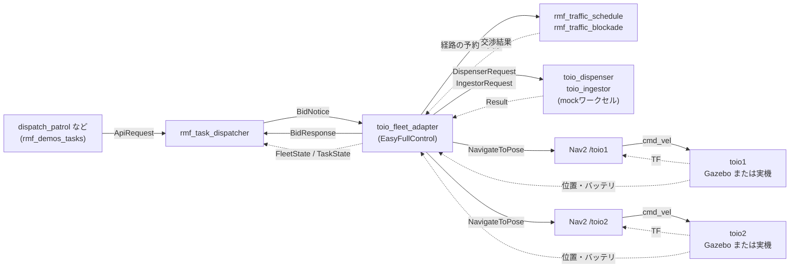
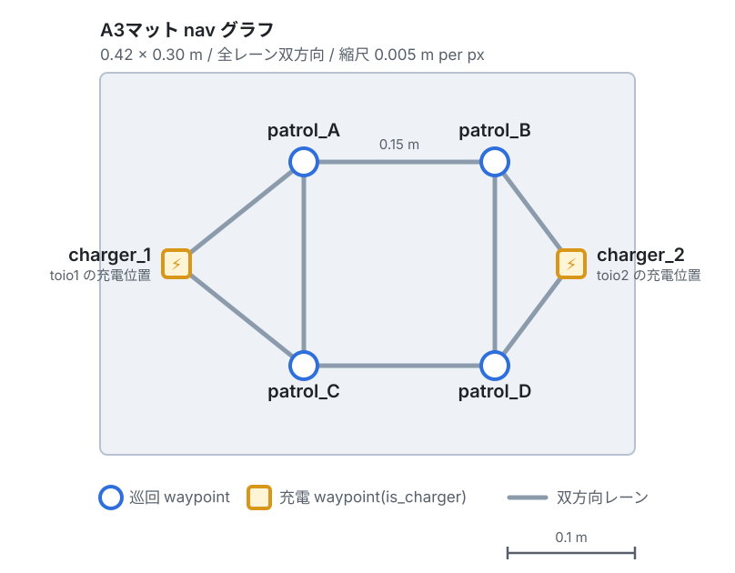
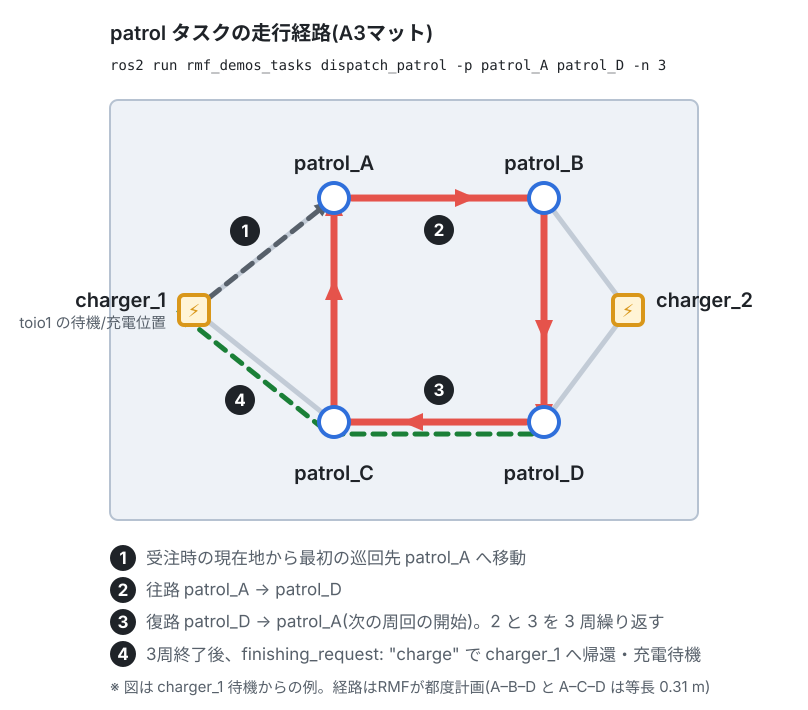
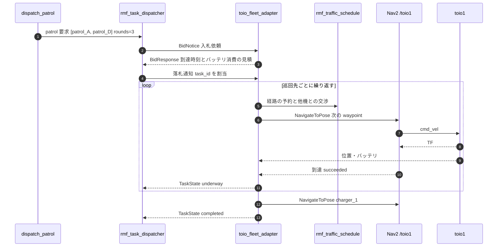
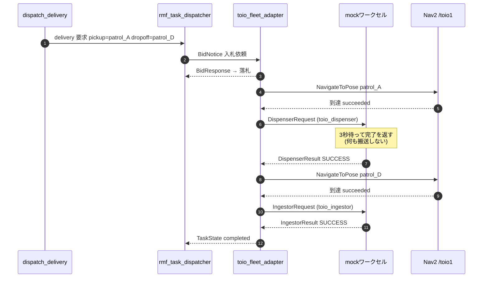
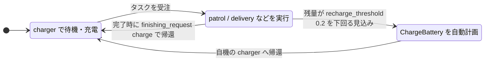

# サンプルOpen-RMFタスクの解説

`toio_rmf_bringup` で起動した環境に投入できるサンプルタスクの内容を図解する。
コマンドはすべて `toio_rmf.launch.py` の起動後、別端末で実行する。

```bash
source /opt/ros/jazzy/setup.bash
source ~/dev_ws/install/setup.bash
```

シミュレーション実行時は各コマンドに `--use_sim_time` を付ける(`cancel_task` を除く)。

## タスク投入の流れ

タスクはCLIから `rmf_task_dispatcher` に投げられ、フリートの入札を経て
`toio_fleet_adapter` が落札する。アダプタは名前空間付きの `NavigateToPose`
アクションでNav2に走行を委譲し、実際にキューブを動かすのはNav2である。



mockワークセルは delivery タスクの荷役要求に応答するためのノードで、
詳細は「[deliveryタスク](#delivery-タスク)」を参照。

走行指令はNav2に委譲されるが、ロボットの位置とバッテリは
`toio_fleet_adapter` が自分で受け取る。実機では `toio_ros2` の
`/toioN/toio/pose` と `/toioN/toio/battery_state` を購読し、
シミュレーションではそれらが無いためTFにフォールバックする。

2台が同じレーンを使おうとした場合の調停は `rmf_traffic_schedule` が行う。
それとは別に、Nav2側でも `peer_robot_costmap_publisher` が相手機の位置を
コストマップに描き込んで局所的な回避を行う(フットプリントは `mat` に応じて
A3=0.10 / A4=0.06 が自動設定される)。

## タスクの投入先となる nav グラフ

タスクで指定する `patrol_A` などは nav グラフの頂点名で、マットごとに定義が異なる。

### A3マット(既定)

6頂点・8レーン、全レーン双方向。2台同時運用でも余裕がある。



### A4マット

6頂点・6レーン。`approach_1 → patrol_A → approach_2 → patrol_B → approach_1` の
**時計回りの一方通行ループ**に、各チャージャーが approach から短い双方向の支線で
ぶら下がる。`patrol_C` / `patrol_D` は存在しない。


一方通行にしているのはマットが狭いためで、詳細は [README](../README.md) の
「A4での2台同時運用の注意」を参照。チャージャーをループ上ではなく支線の先に
置いているのは、単に通過するだけのロボットが駐機中のロボットに突っ込まないため。
A4のチャージャー頂点には `dock_name` が設定されており、到着の最終区間は Dock
イベントとしてキューブ内蔵のターゲット走行で精密に停止する(A3側には無い)。

## patrol タスク

指定した巡回先を順にめぐる周回を、指定した回数だけ繰り返す。README「タスク投入例」のコマンドが
これにあたる。

```bash
ros2 run rmf_demos_tasks dispatch_patrol -p patrol_A patrol_D -n 3 --use_sim_time
```

| 引数 | 意味 |
|---|---|
| `-p` | 巡回先の waypoint 名(順に訪問。2つ以上指定可) |
| `-n` | 周回数(省略時は1周) |
| `-st` | 開始までの遅延秒数(省略時は即時) |



タスクを受注したロボットは現在地から最初の巡回先へ向かい、`-p` で並べた順に
訪問することを `-n` 回繰り返す。全周回を終えるとフリート設定の
`finishing_request: "charge"` により自機のチャージャー(toio1 なら `charger_1`)へ
帰還し、充電待機に戻る。

頂点間をどのレーンで結ぶかはRMFが都度計画するため、図の経路とは異なることがある
(A3では `patrol_A–patrol_B–patrol_D` と `patrol_A–patrol_C–patrol_D` がいずれも
0.31 m で等長)。

### 実行時のノード間のやりとり



入札は `bidding_time_window`(既定2.0秒)の間だけ受け付けられ、見積のよい
ロボットが落札する。したがって2台とも空いている場合、どちらが動くかは
出発地点からの距離などで決まる。

## delivery タスク

pickup で荷物を受け取り、dropoff で降ろす搬送タスク。RMFの delivery では
荷役そのものはロボットではなく**ワークセル(dispenser / ingestor)の仕事**で、
フリート側は waypoint 間の移動だけを担当する。マット上に搬送できる物は無いため、
`toio_rmf.launch.py` が起動する mockワークセル `toio_dispenser` /
`toio_ingestor` が要求に応答してタスクを進める(実際には何も搬送しない)。

```bash
ros2 run rmf_demos_tasks dispatch_delivery -p patrol_A -ph toio_dispenser \
  -d patrol_D -dh toio_ingestor --use_sim_time
```

| 引数 | 意味 |
|---|---|
| `-p` / `-d` | pickup / dropoff の waypoint 名 |
| `-ph` / `-dh` | pickup / dropoff を処理するワークセル名(この環境では `toio_dispenser` / `toio_ingestor` 固定) |
| `-pp` / `-dp` | 荷物の指定 `sku,数量`(省略可。mockワークセルは内容を見ない) |

### 実行時のノード間のやりとり



ワークセルが要求を処理する間(既定3秒、`mock_workcells.py` の
`--handle-seconds`)、ロボットは waypoint 上に停止して見える。

注意点:

- **標準の delivery ではロボットのLED・効果音は出ない。** pickup / dropoff は
  ワークセル側で完結し、フリートアクション `delivery_pickup` /
  `delivery_dropoff` は呼ばれない。キューブ側の見せ方が欲しい場合は後述の
  [dispatch_action](#dispatch_action--フリートアクションの単独実行) を使う。
- **RMF本体へのパッチが前提。** 素のRMFでは delivery 開始時に
  `rmf_task_sequence` の型不一致で fleet_adapter が異常終了する
  ([toio_rmf_bringup#20](https://github.com/atinfinity/toio_rmf_bringup/issues/20)
  に調査結果と修正を記載)。
- シミュレーション(A4)で完走を確認済み。実機ではワークセルへの要求→応答の
  経路は未検証(ノードの起動までは確認済み)。

## その他のタスク

### go_to_place — 単一の目的地へ移動

```bash
ros2 run rmf_demos_tasks dispatch_go_to_place -p patrol_B --use_sim_time
```

指定した waypoint へ1回だけ移動する。特定の1台を動かしたい場合は
`-F toio -R toio1` でフリート名とロボット名を直接指定できる(入札を経ずに
そのロボットへ割り当てられる)。

### dispatch_action — フリートアクションの単独実行

```bash
ros2 run rmf_demos_tasks dispatch_action -s patrol_A -a delivery_pickup --use_sim_time
```

指定した waypoint へ移動し、フリートが宣言しているアクションを実行する。
toioフリートが宣言しているのは `delivery_pickup` / `delivery_dropoff` の2つ。
キューブには搬送機構が無いので、**その場で3秒保持し、LED(pickup=緑 /
dropoff=青)と効果音で何をしているか見せる**形だけの実装になっている。
保持時間・色・効果音はフリート設定(`toio_fleet_config_<mat>.yaml`)の
`toio.actions` で変更できる。シミュレーション・実機とも動作確認済み。

### ChargeBattery — 自動発行される充電タスク

明示的に投入するタスクではなく、RMFが必要と判断したときに自動で計画される。



フリート設定(`toio_fleet_config_<mat>.yaml`)の該当パラメータ:

| パラメータ | 値 | 意味 |
|---|---|---|
| `recharge_threshold` | `0.2` | この残量を下回る見込みになると充電を計画 |
| `recharge_soc` | `1.0` | 充電の目標残量 |
| `account_for_battery_drain` | `true` | 見積時にバッテリ消費を考慮する |
| `finishing_request` | `"charge"` | タスク完了後にチャージャーへ帰還する |

実機のバッテリ残量は `/toioN/toio/battery_state` の `percentage` で確認できる
(キューブの仕様上10%刻みの離散値)。

### cancel_task — 実行中タスクの取り消し

```bash
ros2 run rmf_demos_tasks cancel_task -id <task_id>
```

`task_id` は投入時のCLI出力や `rmf_task_dispatcher` のログに出る。
**`cancel_task` は `--use_sim_time` を受け付けない**(`-id` のみ)。
取り消したロボットは `finishing_request` に従ってチャージャーへ戻る。

## タスク一覧

| タスク | 投入方法 | 図 |
|---|---|---|
| patrol | `dispatch_patrol -p <places...> -n <rounds>` | [走行経路](#patrol-タスク) |
| delivery | `dispatch_delivery -p <pickup> -ph toio_dispenser -d <dropoff> -dh toio_ingestor` | [投入の流れ](#delivery-タスク) |
| go_to_place | `dispatch_go_to_place -p <place>` | — |
| perform_action | `dispatch_action -s <place> -a delivery_pickup` | — |
| ChargeBattery | RMFが自動計画 | [状態遷移](#chargebattery--自動発行される充電タスク) |
| キャンセル | `cancel_task -id <task_id>` | — |

`clean` はフリート設定の `task_capabilities` で無効にしているため、
投入しても落札されない。

## 関連ドキュメント

- [README](../README.md) — 起動方法と launch 引数
- [docs/SETUP.md](SETUP.md) — 環境構築手順と実機検証の手順
