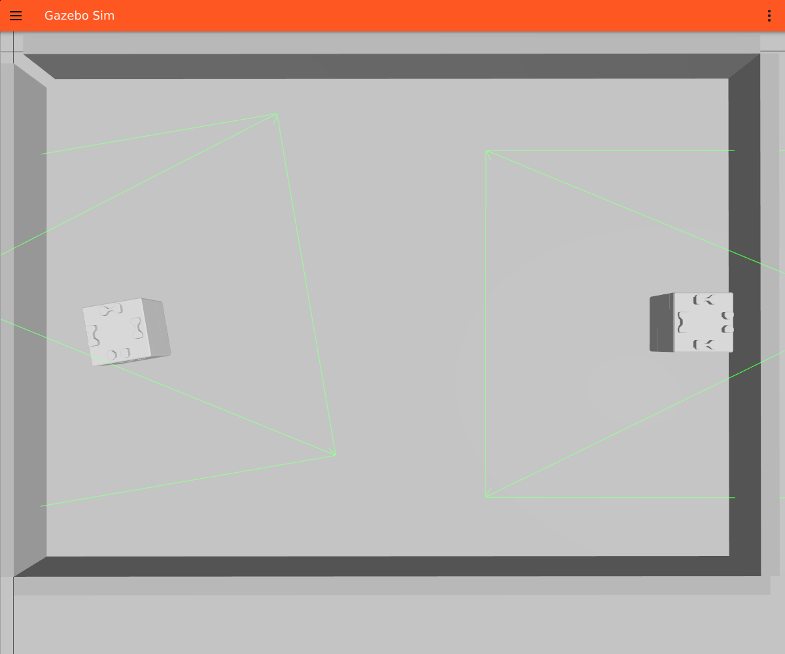

# 章0: 環境構築とスモークテスト

← [目次](README.md) | 次章: [RMFの全体像を掴む →](01_architecture.md)

## 狙い

- toioフリートのOpen-RMF環境を `~/dev_ws` に構築する
- シミュレーションを起動し、2台のキューブがpatrolを完走して充電に帰るところ
  まで見届ける(以降の章の土台になる「動く環境」を確保する)

すでに構築済みで、`toio_rmf.launch.py` が起動できる人はこの章を飛ばしてよい。

## 動かす

### 1. ワークスペースを構築する

環境構築はスクリプトで自動化されている。詳細な内訳とハマりどころは
[docs/SETUP.md](../SETUP.md) にあるので、ここでは最短経路だけ示す。

```bash
gh repo clone atinfinity/toio_rmf_bringup /tmp/toio_rmf_bringup
bash /tmp/toio_rmf_bringup/scripts/setup_environment.sh   # シミュレーションのみ
```

スクリプトは冪等(何度実行してもよい)。Open-RMF一式のapt導入、toio側
パッケージのclone、rosdep、colcon buildまでを行う。

> このチュートリアルはシミュレーションだけで章9まで進むので、`--with-demos` /
> `--with-toio-py` は不要。実機の準備は[章10](10_real_robot.md)で行う。

### 2. RVizの可視化パッチ(推奨)

RMFの可視化ノードはマーカー寸法に0.1mの下限があり、そのままではtoioの小さな
マット(A4で0.30×0.20m)で表示が破綻する。走行など機能面には影響しないが、
このチュートリアルはRVizで内部状態を観察するので、当てておくと後がラク。
手順は[docs/SETUP.md の「rmf_visualization パッチ」](../SETUP.md)を参照。

### 3. スモークテスト(2端末)

**端末A** ── 環境全体を起動する。以降どの章でもこの端末は起動しっぱなしにする:

```bash
source /opt/ros/jazzy/setup.bash
source ~/dev_ws/install/setup.bash
ros2 launch toio_rmf_bringup toio_rmf.launch.py mat:=a3 run_sim:=true use_sim_time:=true
```

Gazebo、Nav2×2台、RMFコア、フリートアダプタ、RVizが立ち上がる。RVizに
A3マットのnavグラフと2台のキューブ(`toio1` / `toio2`)が見えれば成功。

**端末B** ── タスクを1本投入する:

```bash
source /opt/ros/jazzy/setup.bash
source ~/dev_ws/install/setup.bash
ros2 run rmf_demos_tasks dispatch_patrol -p patrol_A patrol_D -n 2 --use_sim_time
```

## 観察する

起動直後の様子(左: Gazebo、右: RViz)。A3マット上に2台のキューブが乗り、
RVizには同じマットのnavグラフ(頂点とレーン)と2台の位置が描かれる。


*Gazebo ── A3マット(グレー)の上に `toio1` / `toio2` の2台。緑の線は各ロボットのレーザースキャン。*


*RViz(真上視点)── 6頂点(`charger_1/2`・`patrol_A/B/C/D`)と全レーンの格子、2台のロボット(マゼンタの球)がそれぞれのチャージャー上にいる。*

- どちらか1台が `patrol_A` → `patrol_D` を2周し、終わると自分のチャージャー
  (`charger_1` / `charger_2`)へ帰還して停止する
- 端末Aのログに `rmf_task_dispatcher` がタスクを受け付け、フリートが入札し、
  落札するまでの流れが流れる(中身は次章以降で読む)

これが**この環境の「正常な1周」**。以降の章はこの1周を分解して、各段階で何が
起きているかを見ていく。

## 理解する

起動時の主な引数は3つだけ覚えておけばよい:

| 引数 | このチュートリアルでの値 | 意味 |
|---|---|---|
| `mat` | `a3`(一部 `a4`) | 使うマット。navグラフとワールドが切り替わる |
| `run_sim` | `true` | toio_gazeboシミュレーションも起動する |
| `use_sim_time` | `true` | シミュレーション時刻(`/clock`)を使う |

`run_sim` と `use_sim_time` の**両方を `true` にする**のがシミュレーションの
合図。片方だけだと時刻がずれてタスクが進まない。全引数は
[README の「主な引数」](../../README.md)にある。

## 確認課題

1. 端末Bで `ros2 node list` を実行し、`/toio1` / `/toio2` 名前空間の
   Nav2ノード群と、RMF側のノードが見えることを確認する(中身は[章1](01_architecture.md)で読む)。
2. スモークテストのpatrolが完走し、2台とも自分のチャージャーに戻ったか。
   戻らない場合は端末Aのログにエラーが出ていないか確認する。

うまく1周できたら、次章でこの環境の「地図」を描く。

← [目次](README.md) | 次章: [RMFの全体像を掴む →](01_architecture.md)
