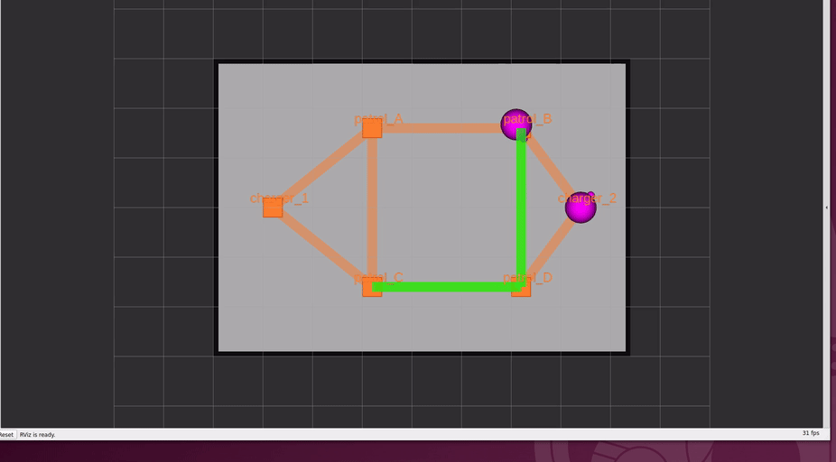

# 章3: 巡回と帰還(patrol)

← [前章: 1台を動かす](02_go_to_place.md) | [目次](README.md) | 次章: [2台と入札 →](04_bidding.md)

## 狙い

- 複数地点を周回する **patrol** タスクを投げる
- タスクで指定する `patrol_A` などが何なのか ── **navグラフ(頂点とレーン)**
  を理解する。ここはフリート処理の「地図」であり、章5の交通調停の舞台になる。
- タスク完了後に**勝手にチャージャーへ帰る**仕組み(`finishing_request`)を知る

## navグラフとは

RMFのロボットは自由空間を好きに動くのではなく、**あらかじめ引かれた頂点
(waypoint)とレーン(lane)の上を動く**。この地図が navグラフ。タスクで
指定する `patrol_A` はこの頂点名で、マットごとに定義が違う。

### A3マット(このチュートリアルの既定)

6頂点・8レーン、**全レーン双方向**。2台同時運用でも余裕がある。

```
charger_1 ── patrol_A ── patrol_B ── charger_2
                │    ╲   ╱    │
                │     ╳       │        (格子状・全双方向)
                │    ╱   ╲    │
             patrol_C ── patrol_D
```

- 頂点: `charger_1` / `patrol_A` / `patrol_B` / `patrol_C` / `patrol_D` / `charger_2`
- `charger_1` はtoio1の、`charger_2` はtoio2の定位置(充電地点)

図の正確な形は [docs/TASKS.md のnavグラフ画像](../TASKS.md)を参照
(`patrol_A–patrol_B–patrol_D` と `patrol_A–patrol_C–patrol_D` はどちらも
0.31mで等長 ── この事実は後で効く)。

> A4マットは形も向きも違う(一方通行ループ)。狭さゆえの設計で、
> [章5](05_traffic.md)と[章10](10_real_robot.md)で扱う。

## 動かす

`patrol_A` → `patrol_D` を3周させる:

```bash
ros2 run rmf_demos_tasks dispatch_patrol -p patrol_A patrol_D -n 3 --use_sim_time
```

| 引数 | 意味 |
|---|---|
| `-p` | 巡回先の頂点名。スペース区切りで複数、**並べた順**に訪問する |
| `-n` | 周回数(省略時1周) |
| `-st` | 開始までの遅延秒(省略時は即時) |

3地点以上も指定できる:

```bash
ros2 run rmf_demos_tasks dispatch_patrol -p patrol_A patrol_B patrol_D patrol_C -n 2 --use_sim_time
```

## 観察する

patrol実行中のRViz。緑の帯が `rmf_traffic_schedule` に予約された走行経路
(スケジュール)で、稼働中のロボットにだけ出る。navグラフと床面図はそのまま残る。


*緑の帯が予約された経路。toio1が巡回中、toio2は `charger_2` で待機。(スケジュールの
footprint/vicinity 円は既定で非表示 ── [章9](09_visualization.md)参照)*


*toio1が巡回先を順に訪問していく様子(toio_gazebo)。*

### 1. 周回と帰還を目で追う

- 落札した1台が現在地から `patrol_A` へ向かい、`-p` の順に訪問することを
  `-n` 回繰り返す
- **全周回を終えると、自機のチャージャーへ帰還して充電待機に戻る**
  (toio1なら `charger_1`)。これはフリート設定の `finishing_request: "charge"`
  による自動挙動 ── タスクには「帰れ」と書いていないのに帰る

### 2. 「経路は毎回RMFが選ぶ」を確かめる

同じ `patrol_A → patrol_D` でも、通るレーンは毎回RMFが計画し直す。A3では
`patrol_A–patrol_B–patrol_D` と `patrol_A–patrol_C–patrol_D` が等長なので、
**実行のたびに違う道を通ることがある**。RVizで経路帯(schedule)を見ると、
頂点の指定と実際の経路が別物だと分かる。これは章5の交通調停の伏線
── 混んでいる方を避けて別レーンを選ぶ余地がここにある。

### 3. タスクの進捗を状態で読む

`/fleet_states` や `rmf_task_dispatcher` のログで、`TaskState` が
`underway`(実行中)→ `completed`(完了)と遷移する。巡回先を1つ訪問する
ごとに進捗が刻まれる。詳しいシーケンス図は
[docs/TASKS.md の patrolタスク](../TASKS.md)にある。

## 理解する

- **patrol = 「移動フェーズ」の繰り返し**。go_to_place(章2)の移動を、
  指定地点ぶん・指定周回ぶん並べたもの。RMFのタスクがフェーズの列だという
  感覚が、ここで補強される。
- **navグラフはフリート全体で共有される地図**。2台とも同じ頂点・レーンを
  使うので、同じレーンを取り合う状況が起きる ── その調停が章5。
- **`finishing_request` はフリートの「片付け」ポリシー**。タスクが終わった
  ロボットをどうするか(charge / park / nothing)をフリート設定で決める。
  toioは `charge`(チャージャーへ帰す)。この帰還も1つのタスクとして
  navグラフ上を走るので、帰り道でも交通調停は効く。

フリート設定でこれらがどう定義されているかは、
[toio_fleet_config_<mat>.yaml](../TASKS.md)(→章6・章8で編集する)にある。

## 確認課題

1. `patrol_B` → `patrol_C` の2地点patrolを何度か投げ、**同じ指定でも通る
   レーンが変わりうる**ことをRVizで確認する。等長経路が2本あるA3ならではの
   現象。「頂点を指定する」ことと「経路を決める」ことは別、と体感する。
2. patrol完了後、ロボットが自分のチャージャーに戻るのを確認する。
   `charger_1` に戻るのはどちらのロボットか?(→ ロボットとチャージャーの
   対応は固定。章6の充電計画で再登場する)
3. 2台とも空いている状態でpatrolを1本だけ投げると、どちらが動くか。
   **なぜその1台か**を次章の入札で解明する。

navグラフという舞台が分かったら、いよいよ2台を登場させて**入札**を見る。

← [前章: 1台を動かす](02_go_to_place.md) | [目次](README.md) | 次章: [2台と入札 →](04_bidding.md)
