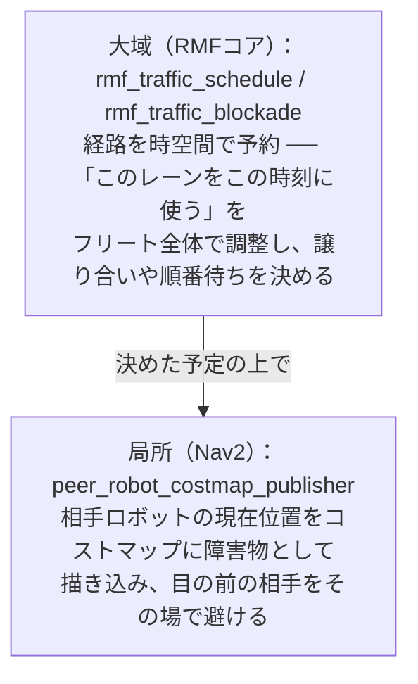
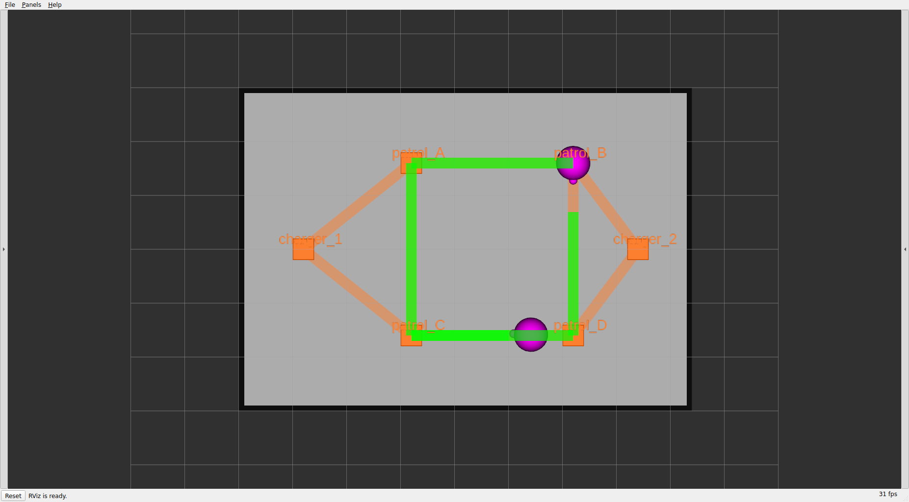
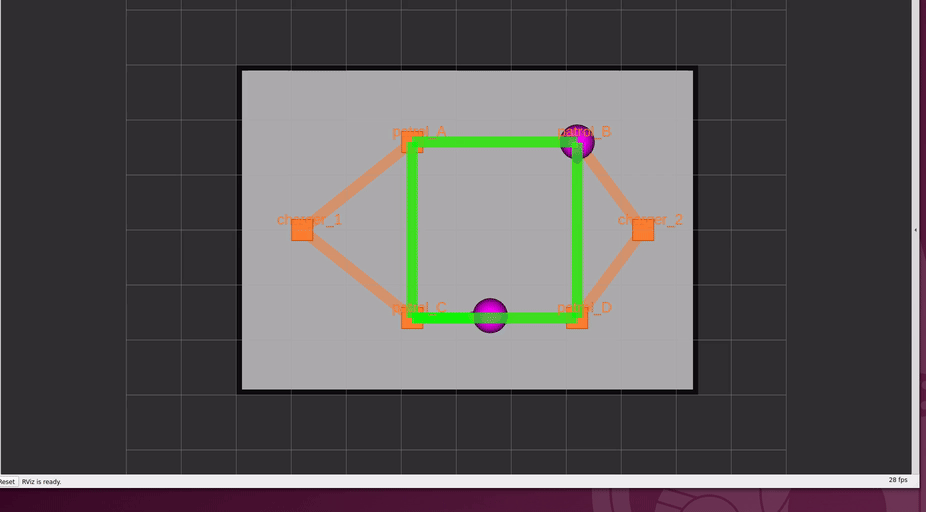
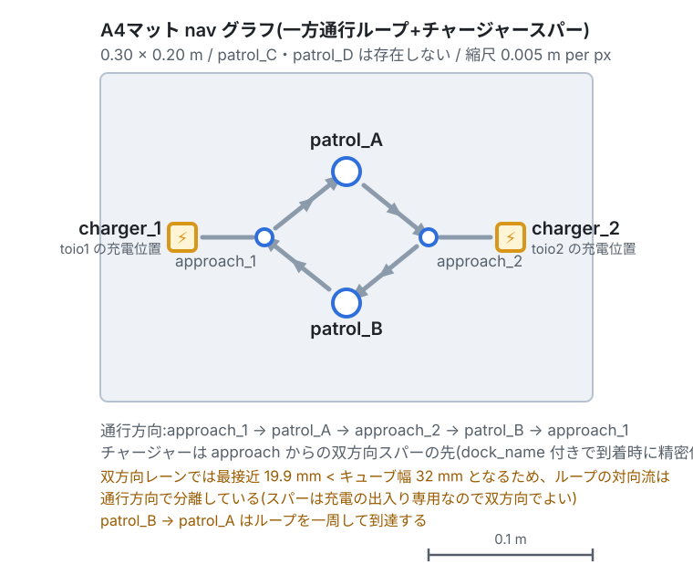

# 章6: 交通調停(traffic)

← [前章: 2台と入札](05_bidding.md) | [目次](README.md) | 次章: [バッテリと自動充電 →](07_battery_charge.md)

## 狙い

- **フリート処理の核心その2** ── 2台が同じ道を使おうとしたとき、衝突せずに
  捌く仕組みを観察する
- RMFの交通調停が**二層**でできていることを理解する:
  - **大域**: `rmf_traffic_schedule` が経路を予約し、先に予約した側を通す
  - **局所**: Nav2の peer costmap が相手を障害物として避ける
- 狭い**A4マット**の一方通行設計が、なぜそうなっているかを知る

## 二層の交通調停

複数ロボットの衝突回避は、RMFでは役割の違う2つの層が担当する。



- **大域**は「予定」の調整。誰がいつどのレーンを通るかを事前に予約し、
  かち合うなら先着を通して後発を待たせる。
- **局所**は「現場」の回避。予定どおりでも近づきすぎたら、Nav2が相手を
  障害物として膨らませて(costmap)ぶつからないよう避ける。

この二層があるので、**大域で順番を決めつつ、局所で詰めの安全**を取る。
peer costmapのフットプリント(相手をどれだけ大きく見るか)は `mat` に応じて
自動設定される(A3=0.10 / A4=0.06)。

## 動かす・観察する

### 実験1: 2台を交差させる

2台に、互いの経路が交わるタスクを**同時に**投げてレーンを競合させる。
別々の端末(または続けて)で:

```bash
# toio1 を charger_1 側 → charger_2 側へ
ros2 run rmf_demos_tasks dispatch_go_to_place -p charger_2 -F toio -R toio1 --use_sim_time
# toio2 を charger_2 側 → charger_1 側へ(すれ違いになる)
ros2 run rmf_demos_tasks dispatch_go_to_place -p charger_1 -F toio -R toio2 --use_sim_time
```

**観察ポイント**:
- RVizで2本の**経路帯**(schedule)が引かれる。かち合う区間があると、
  片方が別レーンへ迂回するか、手前で**待つ**。これが大域調停。
- 接近時、Nav2側で相手を避けて膨らむ動き(局所回避)が見える。A3は格子で
  逃げ道があるので、たいてい別レーンへ回り込む。


*2台に別々のタスクを投げた状態。2本の緑の経路帯(スケジュール予約)が格子を
縫うように引かれ、競合区間で譲り合いが起きる。*


*2台が格子上を動きながらレーンを分け合う様子(toio_gazebo)。*

### 実験2: 予約と待ちをログで見る

大域調停は `rmf_traffic_schedule_primary` が担っている。2台を競合させた
まま、スケジュールの動きを覗く:

```bash
ros2 topic echo /fleet_states
```

一方が `moving`、他方が待ちで速度が落ちる/止まる、という状態変化が
読める。**「入札で誰がやるか」を決めた後、走行中は交通調停が順番を捌く**
── 章5との役割の違いがここではっきりする。

### 実験3(任意): 狭いA4で一方通行を体感する

A4マットは狭く(0.30×0.20m)、双方向にすると2台が正面衝突しやすい。そこで
navグラフを**時計回りの一方通行ループ**にしてある。端末Aを落として起動し直す:

```bash
ros2 launch toio_rmf_bringup toio_rmf.launch.py mat:=a4 run_sim:=true use_sim_time:=true
```


*A3の双方向格子と違い、`approach_1 → patrol_A → approach_2 → patrol_B → approach_1`
の**時計回り一方通行ループ**。各チャージャーは approach から伸びる双方向の支線の先に
ぶら下がる。矢印がレーンの向き。*

A4の頂点は `patrol_A` / `patrol_B` / `approach_1` / `approach_2` +
`charger_1` / `charger_2`(`patrol_C` / `patrol_D` は無い)。patrolを投げると:

```bash
ros2 run rmf_demos_tasks dispatch_patrol -p patrol_A patrol_B -n 2 --use_sim_time
```

**観察**: `patrol_B → patrol_A` へ戻るとき、逆走せず**ループを一周して**戻る。
一方通行なので遠回りに見えるが、これが正常。狭い場所で正面衝突を構造的に
避けるための設計。

> **A4での2台同時運用は物理限界に近い**。頂点付近で同時に入れ替わると角が
> 接触しうる。確実な非接触が要るならA3を使う。詳細は
> [README の「A4での2台同時運用の注意」](../../README.md)を参照。

## 理解する

- **交通調停 ≠ 入札**。入札(章5)は「誰がやるか」の意思決定、交通調停は
  「走り出した後の道の分け合い」。この2つが揃って初めてマルチロボットが
  成立する。
- **大域と局所は補い合う**。大域だけだと現場の誤差でぶつかりうるし、局所
  だけだと膠着(お見合い)しやすい。RMFは大域で大枠の順番を決め、局所で
  最後の安全を取る。
- **navグラフの設計は交通調停の効きを左右する**。A3の格子は逃げ道が多く
  調停がラク、A4の一方通行は逃げ道を捨てる代わりに正面衝突を封じる。
  「**地図の作り方が渋滞の起きやすさを決める**」という、フリート運用の
  実務的な勘所。
- peer costmapのフットプリントを大きくしすぎると、狭いA4では通路を塞いで
  Nav2がデッドロックする。だからマットごとに自動で加減している
  (この事情は [README の `peer_footprint_size`](../../README.md) に詳しい)。

二層の詳しい説明は [docs/TASKS.md](../TASKS.md) にもある。

## 確認課題

1. A3で2台を正面から向かわせ(実験1)、RVizで**どちらが待ち・どちらが
   迂回したか**を観察する。何度か繰り返し、毎回同じとは限らないことを見る。
2. A4に切り替え、`patrol_B → patrol_A` が一方通行で一周して戻ることを確認
   する。A3の双方向と比べ、同じ2地点patrolでも走り方がまるで違う理由を
   説明できるか。
3. (発展)A4で2台同時にタスクを投げ、頂点付近の掠りを観察する。物理的な
   狭さと調停の限界を体感したうえで、**なぜ実機検証はA4で1台ずつが基本
   なのか**([章11](11_real_robot.md))を考える。

道の分け合いまで見たら、次は**バッテリが尽きそうなとき勝手に充電へ帰る**、
フリートの自律的な自己管理を見る。

← [前章: 2台と入札](05_bidding.md) | [目次](README.md) | 次章: [バッテリと自動充電 →](07_battery_charge.md)
