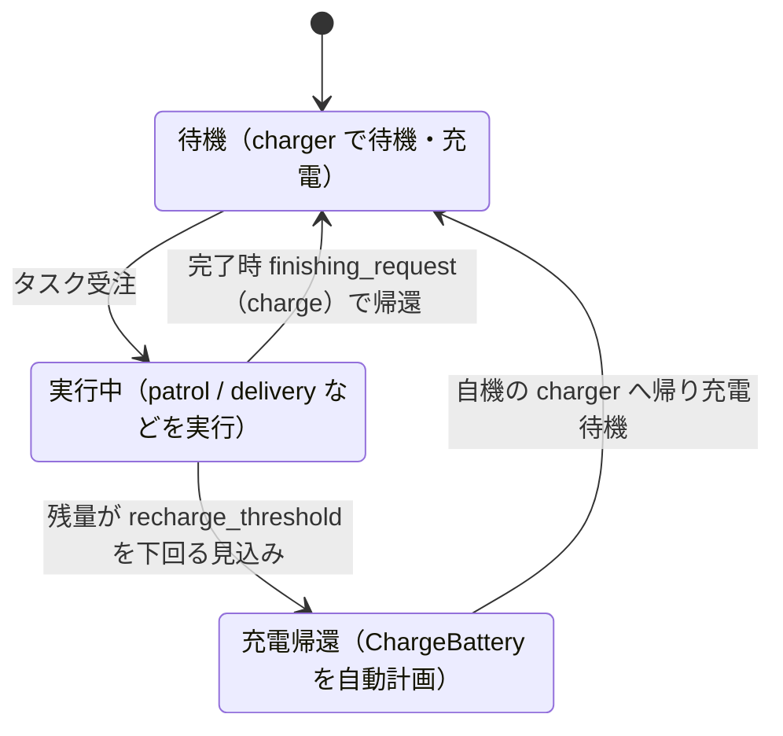

# 章7: バッテリと自動充電(ChargeBattery)

← [前章: 交通調停](06_traffic.md) | [目次](README.md) | 次章: [搬送とワークセル →](08_delivery.md)

## 狙い

- RMFがロボットのバッテリを見張り、**尽きる前に勝手に充電へ帰す**仕組みを知る
- 明示的に投げるタスクではない **ChargeBattery** が、どんな条件で自動計画
  されるかをフリート設定から理解する
- 実行中タスクを**キャンセル**する操作を覚える(充電・帰還と絡む)

入札(章5)・交通調停(章6)に続く、フリートの**自己管理**の層。

## ChargeBatteryは「投げない」タスク

これまでのタスク(go_to_place / patrol)はCLIから投げた。ChargeBatteryは違い、
**RMFが「このままだとバッテリが足りない」と判断したときに自動で計画する**。
運用者が忘れていても、ロボットが自分で充電に帰る ── これがフリートを
長時間ほったらかせる理由。

判断はフリート設定 `toio_fleet_config_<mat>.yaml` の値で決まる:

| パラメータ | 値 | 意味 |
|---|---|---|
| `recharge_threshold` | `0.2` | 残量がこれを**下回る見込み**になると充電を計画 |
| `recharge_soc` | `1.0` | 充電の目標残量(満充電) |
| `account_for_battery_drain` | `true` | 見積もり時にバッテリ消費を織り込む |
| `finishing_request` | `"charge"` | タスク完了後もチャージャーへ帰す |

`account_for_battery_drain: true` が効いているので、RMFは**入札の段階から**
「このタスクを最後までやったらバッテリはいくつになる?」を計算している。
足りなくなる見込みなら、先に充電を挟む。

## 状態遷移で捉える



図の詳細版は [docs/TASKS.md の ChargeBattery](../TASKS.md) にある。

## 動かす・観察する

### 1. バッテリの現在値を見る

各ロボットの `battery_percent` は `/fleet_states` に入っている:

```bash
ros2 topic echo /fleet_states --once
```

> [!IMPORTANT]
> **シミュレーションではこの値は 100% に固定**され、放電も充電もしない。toioの
> アダプタは実機の `/toioN/toio/battery_state` を残量の入力にしており、sim には
> それが無いため。フリート設定の `account_for_battery_drain` はタスクの
> **見積り**(入札コスト)には効くが、**報告される残量そのものは動かない**。
> 実機ではこの値がキューブの実測(10%刻みの離散値)由来になる
> (sim/realの差は[章11](11_real_robot.md))。

### 2. ChargeBattery はシミュレーションでは発火しない

上の状態遷移の「実行中 → 充電帰還」は、残量が `recharge_threshold` を**下回る
見込み**になると起きる。しかし **sim では残量が 100% に張り付いたまま**なので、
周回数を増やしても、`recharge_threshold` を上げても、消費電力を上げても、
**ChargeBattery は発火しない**(このリポジトリで実測確認)。

> 実測メモ: patrol を30周させても `battery_percent` は 100.0% のまま。
> `recharge_threshold` を 0.9 に上げ `ambient_system.power` を100倍にしても、
> 報告残量が動かない以上 RMF は「下回る見込み」と判断できず充電を挟まない。
> アダプタのログにも
> `The current battery percentage is 100.0% ... charging at an average rate of 0.0 %/hour`
> と出る。

したがって **ChargeBattery の自動発火は実機で検証する**(キューブの `battery_state`
が実際に放電する)。手順は[章11](11_real_robot.md)と
[issue #35](https://github.com/atinfinity/toio_rmf_bringup/issues/35)。sim で確認
できる充電まわりの挙動は、次の **finishing_request による完了後の帰還**である。

### 3. 完了後の自動帰還を見る(finishing_request)

短いpatrolでも、**完了後にチャージャーへ帰る**のは `finishing_request: "charge"`
の働き。章4で見た「勝手に帰る」挙動の正体がこれ。ChargeBatteryの「途中で
帰る」と、finishing_requestの「終わったら帰る」は別トリガだが、どちらも
「充電待機へ戻す」点で連続している。

## キャンセルと帰還

実行中のタスクは途中で取り消せる。取り消したロボットは `finishing_request` に
従ってチャージャーへ戻る:

```bash
ros2 run rmf_demos_tasks cancel_task -id <task_id>
```

- `task_id` は投入時のCLI出力、または `rmf_task_dispatcher` のログに出る
- **`cancel_task` は `--use_sim_time` を受け付けない**(`-id` のみ)。
  このチュートリアルで唯一 `--use_sim_time` を付けないコマンド。

**やってみる**: 長いpatrolを投げ、途中で `cancel_task -id <task_id>` する。
ロボットが巡回をやめてチャージャーへ帰るのを確認する。

## 理解する

- **バッテリ管理はフリートの自律性の要**。入札で「誰が」、交通調停で「どう
  道を分けるか」を見てきたが、ChargeBatteryは**いつ休むかを自分で決める**
  層。この3つが揃うと、運用者は個々のロボットの世話をしなくてよくなる。
- **見積もりにバッテリが入る**ので、章5の入札と繋がっている。残量の少ない
  ロボットは「やったら足りなくなる」と見積もられ、入札で不利になったり、
  受注前に充電を挟んだりする。**入札・充電・タスク実行は独立でなく連動**。
- **finishing_request と ChargeBattery は別物**。前者は「タスク完了後の
  片付けポリシー」、後者は「実行中に残量が危ういときの割り込み」。混同
  しやすいが、トリガが違う。

## 確認課題

1. `/fleet_states` の `battery_percent` を echo し、長いpatrol中も **100% から
   動かない**ことを確認する(sim の制約。上の「[!IMPORTANT]」の裏取り)。
   「なぜ sim では ChargeBattery が発火しないか」を自分の言葉で説明できるか。
2. patrol 完了後、ロボットが `finishing_request: "charge"` で自機のチャージャーへ
   帰るのを確認する(**これは sim でも動く**充電まわりの挙動)。`finishing_request`
   を `nothing` に変えて起動し直すと帰らなくなることも試す(確認後は戻す)。
3. 実行中タスクを `cancel_task` で取り消し、ロボットがチャージャーへ戻る
   ことを確認する。キャンセルと finishing_request の関係を説明できるか。

自己管理まで見たら、次は「移動」以外のタスク ── **荷役**(delivery)へ。
ロボットだけでなく**ワークセル**という別の登場人物が出てくる。

← [前章: 交通調停](06_traffic.md) | [目次](README.md) | 次章: [搬送とワークセル →](08_delivery.md)
