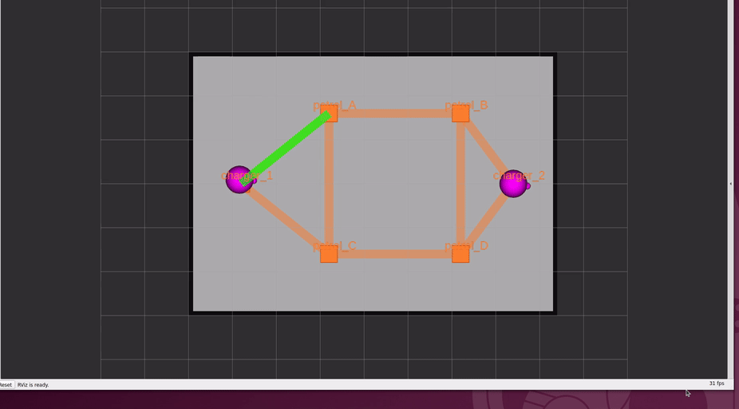

# 章8: 搬送とワークセル(delivery)

← [前章: バッテリと自動充電](07_battery_charge.md) | [目次](README.md) | 次章: [フリートアクション →](09_fleet_action.md)

## 狙い

- 「移動」だけでない **delivery**(荷物をpickup地点で受け取りdropoff地点で
  降ろす搬送)タスクを扱う
- RMFの delivery では荷役を**ロボットではなくワークセル**(dispenser /
  ingestor)が担う、という**役割分担**を理解する
- タスクが「フェーズの列」でできていることを、移動+荷役の組み合わせで見る

> [!NOTE]
> delivery は **Ubuntu 24.04 + apt の Open-RMF(本チュートリアルの前提環境)では
> そのまま動く**(このリポジトリで pickup→dropoff の完走を実測確認)。
> macOS/RoboStack でソースビルドした RMF では別の既知問題でクラッシュすることが
> ある(下の「補足: 環境による既知問題」を参照)。

## ワークセルという登場人物

これまでロボットは自分で移動していた。deliveryでは「荷物を積む/降ろす」動作が
要るが、**RMFではその荷役をロボットではなくワークセルという別ノードが担当する**:

- **dispenser**(払い出し機): pickup地点で荷物をロボットに載せる係
- **ingestor**(受け入れ機): dropoff地点で荷物を受け取る係

フリート(ロボット)の仕事は**waypoint間の移動だけ**。着いたらワークセルに
「荷役して」と要求を投げ、ワークセルが「完了」を返したら次へ進む。

toioのマットに実際に運べる物は無いので、`toio_rmf.launch.py` が
**mockワークセル**(`toio_dispenser` / `toio_ingestor`)を起動し、要求に対して
一定時間後に「完了」を返す(実際には何も運ばない)。これは
[章2](02_architecture.md)で `ros2 node list` に出ていたノード。

## 補足: 環境による既知問題(Ubuntuでは無関係)

**Ubuntu 24.04 + apt の Open-RMF では delivery はそのまま動く。** このリポジトリでの
実測(toio_gazebo, A3)では、入札 → 落札 → `patrol_A`(dispenser で pickup)→
`patrol_D`(ingestor で dropoff)→ チャージャー帰還まで、fleet_adapter が
**クラッシュせず完走**した。

一方 **macOS/RoboStack でソースビルドした RMF** では、delivery 開始時に
`rmf_task_sequence` の `std::optional<nlohmann::json>` の ABI 不整合で
fleet_adapter が異常終了する既知の問題がある
([#20](https://github.com/atinfinity/toio_rmf_bringup/issues/20))。原因は
ライブラリ間の nlohmann コンパイル定義(`JSON_DIAGNOSTICS` 等)の食い違いで、
**一貫ビルドされた apt deb では再現しない**。この章は Ubuntu 前提なので、
通常この問題には遭遇しない。

## 動かす

pickupを `patrol_A`(処理はdispenser)、dropoffを `patrol_D`(処理はingestor)
とする:

```bash
ros2 run rmf_demos_tasks dispatch_delivery -p patrol_A -ph toio_dispenser \
  -d patrol_D -dh toio_ingestor --use_sim_time
```

| 引数 | 意味 |
|---|---|
| `-p` / `-d` | pickup / dropoff の waypoint 名 |
| `-ph` / `-dh` | それを処理するワークセル名(この環境では `toio_dispenser` / `toio_ingestor` 固定) |
| `-pp` / `-dp` | 荷物の指定 `sku,数量`(省略可。mockは中身を見ない) |

## 観察する


*落札したロボットが pickup(`patrol_A`)→ dropoff(`patrol_D`)へ移動する様子
(toio_gazebo)。各地点でワークセルの処理を待つ間、頂点上で停止して見える。*

タスクは**移動→荷役→移動→荷役**の順で進む:

1. ロボットが `patrol_A`(pickup)へ移動
2. `toio_dispenser` へ **DispenserRequest** を送る。ワークセルが既定3秒
   待って完了を返す間、ロボットは頂点上で停止して見える
3. `patrol_D`(dropoff)へ移動
4. `toio_ingestor` へ **IngestorRequest**、完了で `TaskState` が `completed`

ワークセルとのやりとりを覗くには:

```bash
ros2 topic echo /dispenser_requests   # 別端末で。pickup到達時に要求が飛ぶ
```

荷役の待ち時間は `mock_workcells.py --handle-seconds`(既定3秒)。詳しい
シーケンス図は [docs/TASKS.md の deliveryタスク](../TASKS.md)にある。

**注意**: 標準の delivery では**キューブのLED・効果音は出ない**。pickup /
dropoff はワークセル側で完結し、フリートのアクション(`delivery_pickup` /
`delivery_dropoff`)は呼ばれない。キューブ側で「荷役してる感」を出したい場合
は次章の perform_action を使う。

## 理解する

- **タスク = フェーズの列**、が最もはっきり見えるのが delivery。
  「移動フェーズ → 荷役フェーズ → 移動フェーズ → 荷役フェーズ」と積まれて
  いる。go_to_place(移動1つ)、patrol(移動の繰り返し)からの発展として
  捉えると一貫する。
- **役割分担**が肝。ロボットは移動だけ、荷役はワークセル。この分離のおかげで、
  実際の倉庫では「アームを持つ払い出し機」「ベルトコンベアの受け入れ口」など
  ロボットとは別のハードにワークセルを割り当てられる。toioでは運ぶ物が無いので
  mockが「完了」を返すだけの実装になっている。
- ワークセルへの要求は `DispenserRequest` / `IngestorRequest` という専用の
  トピックで飛ぶ。**フリートアダプタは移動をNav2へ、荷役をワークセルへ、と
  別々の相手に指示を出している**。

## 確認課題

1. delivery を投げ、ロボットが pickup 地点で**約3秒停止**してから dropoff へ
   向かうことを観察する。この停止が DispenserRequest の処理時間。
2. `/dispenser_requests` と `/ingestor_requests` をechoし、pickup到達時と
   dropoff到達時にそれぞれ要求が飛ぶことを確認する。「移動」と「荷役」で
   指示の宛先が違うことを見る。
3. 同じpickup/dropoffを go_to_place 2本(`patrol_A` へ行って、`patrol_D` へ
   行く)で代用したときと比べ、delivery が余分に何をしているか(=荷役
   フェーズ)を言葉にする。

荷役の「本物の分担」を見たら、次章では逆に**キューブ自身に演技をさせる**
フリートアクションを扱う。

← [前章: バッテリと自動充電](07_battery_charge.md) | [目次](README.md) | 次章: [フリートアクション →](09_fleet_action.md)
