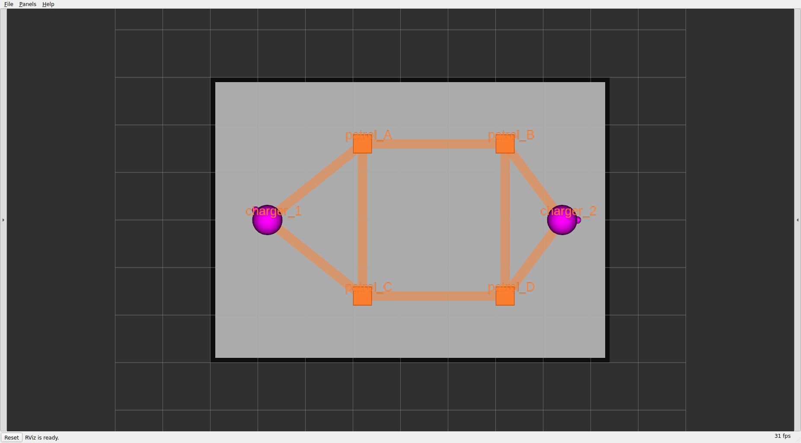
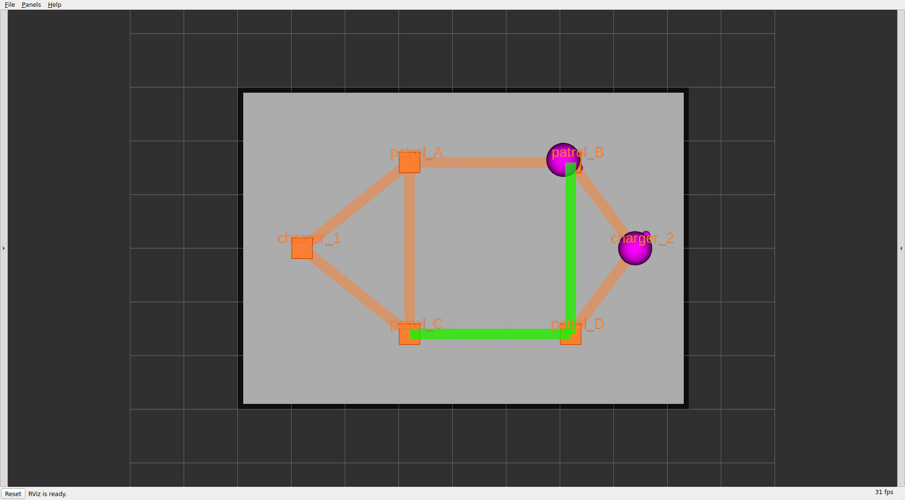
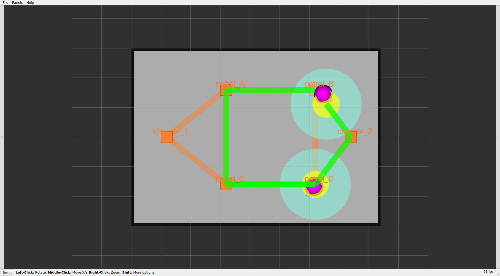

# 章9: 可視化とダッシュボード

← [前章: フリートアクション](08_fleet_action.md) | [目次](README.md) | 次章: [実機へ →](10_real_robot.md)

## 狙い

- ここまで断片的に使ってきた **RViz** の見方を整理する(何がどの層の情報か)
- ブラウザからタスク投入・監視ができる **rmf-webダッシュボード**を立てる
  (任意 ── CLIとRVizだけでも運用できる)
- sim編の総仕上げとして、「投入 → 走行 → 完了」をGUIで一望する

## RVizで何が見えているか ── マーカーの読み方

`toio_rmf.launch.py` は既定でRVizを起動する。真上から見た絵に色々な図形が
重なって見えるが、**一つ一つが別のトピックから来る「フリート処理の内部状態」**
で、それぞれ担当ノードが違う。まず**待機中(idle)**の絵から:


*待機中 ── navグラフ(オレンジ)と2台のロボット(マゼンタ)がチャージャー上にいる。*

| 見た目 | 名前 | 意味 | 出どころ(トピック) |
|---|---|---|---|
| **マゼンタ(紫)の球** | ロボット本体 | フリートが自己申告する各ロボットの現在位置。1台に1つ | `/fleet_markers`(`body`)。半径は `toio_radius`=0.016m |
| 球から出る**小さな突起** | 機首(nose) | ロボットの**向き** | `/fleet_markers`(`nose`) |
| **オレンジの正方形** | waypoint(頂点) | navグラフの停留点。タスクで指定する `patrol_A` 等の正体 | `/map_markers`(`toio/waypoints`) |
| **オレンジの半透明の帯**(格子) | lane(レーン) | 頂点間の通行可能経路。双方向格子 | `/map_markers`(`toio/lanes`) |
| **オレンジの文字** | ラベル | waypoint名 | `/map_markers`(`toio/labels`) |
| **グレーの矩形(黒枠)** | 床面図(floorplan) | マットの外形 | `/floorplan`(building_map_server) |
| 細いグレーの**方眼** | Grid | RVizの目盛り(5cm刻み)。**マーカーではない** | RViz内蔵 |

navグラフ(オレンジ)= RMFの「地図」([章3](03_patrol.md))、マゼンタの球 =
フリートの「自己申告」([章1](01_architecture.md))。**タスクを投げると、ここに
"稼働中"のマーカーが増える**:


*走行中 ── 緑の帯がスケジュール(予約経路)、稼働ロボットに teal と黄の円が付く。*

| 見た目 | 名前 | 意味 | 出どころ(トピック) |
|---|---|---|---|
| **緑の帯** | スケジュール(schedule) | `rmf_traffic_schedule` が予約した**将来の走行経路**。稼働中のロボットにだけ出る。2台が競合するとここで譲り合いが見える([章5](05_traffic.md)) | `/schedule_markers`(ns `participant N`) |
| **teal/黄の円**(vicinity / footprint) | 予約軌道上の周辺域・占有域 | **既定では非表示**(下記)。スケジュールが予約した**軌道上の位置**に描かれる ── vicinity=他機への「近づくな」領域、footprint=占有面積 | `/schedule_markers`(ns `participant location N`) |

つまり色で層が分かれている ── **オレンジ=地図(静的)、マゼンタ=ロボットの
実位置、緑=いま走っているロボットの予約経路(動的)**。

> **なぜ teal/黄(footprint/vicinity)を既定で隠しているか**
>
> これらは**スケジュール(=予約)軌道上の位置**に描かれ、**実機(マゼンタ)の
> 現在位置とは別物**。ロボットが方向転換のたびに一瞬止まる(RPPの
> `use_rotate_to_heading`)ため予約軌道から遅れては追いつき、その差で teal/黄の
> 円が前後に**跳ねて見える**(実機自体は滑らか。実測で確認済み)。混乱を避けるため
> `rviz/toio_rmf.rviz` の `ScheduleMarkers` で namespace `participant location *`
> を `false` にして**既定で非表示**にしている。緑の予約経路帯(`participant *`)は
> 残している。
>
> **再表示したい場合**: RVizの `ScheduleMarkers` 表示を開き `participant location 0/1`
> のチェックを入れる(または当該 namespace を `true` にする)。有効化すると、稼働中の
> ロボットの周囲に teal(vicinity)と黄(footprint)の円が現れる ↓


*参考:`participant location` を表示した状態。2台のロボットに teal の vicinity と
黄の footprint の円が描かれる(既定ではこれらを非表示にしている。本チュートリアルの
他のスクリーンショット・動画は既定=非表示で撮影している)。*

> toioのマットは数cm〜数十cm。RMFの可視化は数十m級の建物向けに作られている
> ため、[章0](00_setup.md)で触れたパッチを当てておかないと、この footprint /
> vicinity が高さ1m級の巨大な円柱になってnavグラフを覆い隠す(表示した場合)。
> パッチの背景は [docs/SETUP.md](../SETUP.md) に詳しい。

**やってみる**: [章5](05_traffic.md)の2台交差タスクをもう一度投げ、RVizで
経路帯が2本引かれ、競合区間で片方が待つ/迂回する様子を観察する。CLIログで
読んでいた交通調停が、絵として一望できる。

## rmf-webダッシュボード(任意)

ブラウザからタスクを投げ、フリートを監視するGUI。ROS 2スタックはホストで
そのまま動かし、rmf-webだけをコンテナ化する構成。**使わなくても本パッケージ
の動作には影響しない**ので、GUIを試したい人向け。

構築とトラブルシュートの全ては [docs/DASHBOARD.md](../DASHBOARD.md) に
あるので、ここでは最短の流れだけ示す。

### 1. ダッシュボードイメージをビルド(初回のみ)

```bash
cd ~/dev_ws/src/toio_rmf_bringup/docker
docker compose build dashboard
```

### 2. コンテナ起動(シミュレーションなので USE_SIM_TIME=true)

```bash
USE_SIM_TIME=true docker compose up -d
docker compose logs -f api-server   # 起動確認
```

### 3. ROS 2スタックを server_uri 付きで起動

端末Aを、ダッシュボードのapi-serverに繋ぐ形で起動し直す:

```bash
ros2 launch toio_rmf_bringup toio_rmf.launch.py \
  mat:=a3 run_sim:=true use_sim_time:=true \
  server_uri:=ws://localhost:8000/_internal
```

### 4. ブラウザで開く

<http://localhost:3000>

- **Map** タブ … マットと2台のキューブ
- **Robots** タブ … `toio1` / `toio2` がフリート `toio` として並び、位置と
  バッテリが更新される([章6](06_battery_charge.md)で見た値がGUIに出る)
- **Tasks** タブ … patrol / delivery をフォームから投入できる

**やってみる**: Tasksタブから patrol を投入し、CLI(`dispatch_patrol`)で
投げたときと**同じタスクがGUIにも現れる**ことを確認する。CLIとGUIは同じ
RMFコアに繋がっている ── 入口が違うだけ。

> ダッシュボードには既知の注意点(白画面・マーカーがマットを覆う・macOSでの
> ネットワーク制約など)がいくつかある。詰まったら
> [docs/DASHBOARD.md のトラブルシュート](../DASHBOARD.md)を先に見ること。

## 理解する

- **RVizは開発者の観察窓、ダッシュボードは運用者の操作卓**。RVizは内部状態
  (予約・TF・navグラフ)を細かく見るのに向き、rmf-webは「タスクを投げて
  結果を見る」運用に向く。目的で使い分ける。
- どちらも**RMFコアの状態を映しているだけ**で、コアの動作を変えるものでは
  ない。GUIから投げたpatrolも、CLIから投げたpatrolも、入札→交通調停→充電
  という同じ処理を通る(章4〜6)。可視化は理解を助けるが、本質は下の層に
  ある、という視点を保つ。

## 確認課題

1. RVizで2台交差タスクの経路帯を観察し、[章5](05_traffic.md)でログから読んだ
   「待ち・迂回」が絵として一致することを確認する。
2. (ダッシュボードを立てた人)Tasksタブから patrol を投入し、Robotsタブで
   バッテリと位置が更新されるのを見る。CLI投入のタスクもTasks一覧に出るか。
3. 同じ1本のpatrolを、RVizとダッシュボードの**両方で同時に**眺め、片方が
   絵、もう片方が表として同じ出来事を映していることを体感する。

これでシミュレーション編は完走。最後の章で、ここまで学んだことを**実機の
toioキューブ**へ持っていく ── 何が変わり、何が変わらないかを見る。

← [前章: フリートアクション](08_fleet_action.md) | [目次](README.md) | 次章: [実機へ →](10_real_robot.md)
